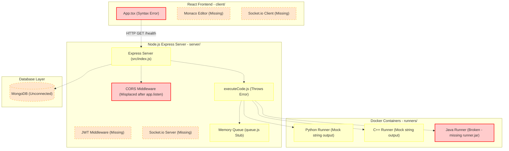
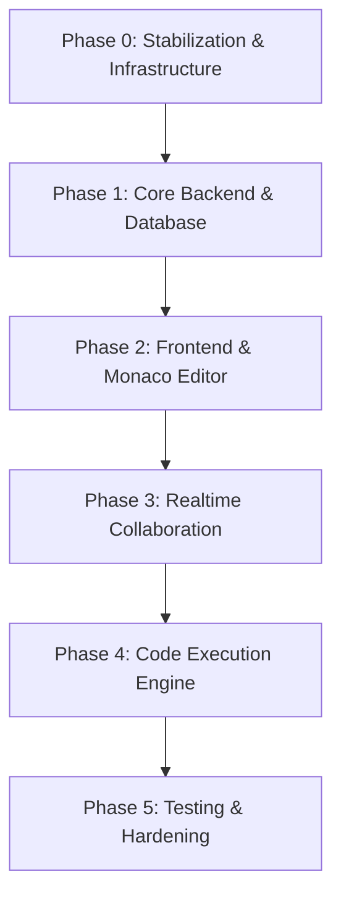

# CURRENT_STATUS.md — Capsule Project Status Report

**Date of Audit:** September 1, 2026  
**Auditor:** Antigravity AI  
**Repository Path:** `d:\AWT_2026`  
**Methodology:** `inspect → understand → document → identify gaps → prioritize → define workflow → implement incrementally → verify`

---

## 1. Executive Summary

### Project Overview
**Capsule** (referred to as **CodeCollab** within repository configuration and documentation) is intended to be a real-time, browser-based collaborative coding platform. The target feature set includes multi-user shared coding rooms, live code editing using the Monaco Editor, real-time text chat, sandboxed server-side code compilation and execution for Python, Java, and C++ using Docker, and persistence for users, rooms, and execution history.

### Current Implementation State
The repository currently contains a **minimal structural skeleton / prototype shell**. While the folder hierarchy is well-organized and intended architectural layers are documented in `README.md`, almost all functional application files consist of empty placeholders, single-line stubs, or missing dependencies.

### What Appears to Be Working
* **Repository Directory Structure:** Standardized layout splitting `client/`, `server/`, `runners/`, `docs/`, `demo/`, and `eval/`.
* **Basic Node Syntax Check:** `server/src/index.js` contains syntactically valid JavaScript for an Express server setup (though it exhibits critical runtime bugs and lacks installed node modules).

### Biggest Current Gaps
1. **Missing NPM Dependencies:** Neither `client/package.json` nor `server/package.json` lists any third-party packages (e.g., `react`, `express`, `socket.io`, `mongoose`, `monaco-editor`, `dockerode`).
2. **Broken Frontend Entry Point:** `client/src/App.tsx` contains a React Hook (`useEffect`) called outside of the component function, causing TypeScript / React compilation failure.
3. **Broken Backend Server Configuration:** `server/src/index.js` invokes `app.listen()` prior to registering CORS middleware (`app.use(cors(...))`).
4. **Unimplemented Code Execution Engine:** `server/src/execution/executeCode.js` throws `Error('executeCode not implemented')`. `runners/java/Dockerfile` references a non-existent `runner.jar`.
5. **Absent Feature Layers:** Database models (`server/src/models/`), Socket.io handlers (`server/src/sockets/`), REST routes (`server/src/routes/`), and React UI components (`client/src/components/`) contain only `.gitkeep` files.
6. **Mock Test Suite:** All test files in `server/tests/` contain dummy assertions (`expect(true).toBe(true)`), and `server/package.json` has no test script defined.

### Primary Technical Risks
* **Docker Host Dependency:** `docker` is not installed or available in PATH on the current host system (`CommandNotFoundException`).
* **Lack of Realtime Conflict Resolution Strategy:** No CRDT or Operational Transformation (OT) is configured; the project relies on a single "driver" model.
* **Unvalidated Container Security:** No container network isolation or resource constraints are active.

### Recommended Immediate Focus
**Phase 0 — Stabilization & Infrastructure:** Correct `package.json` dependency definitions for both `client` and `server`, fix syntax errors in `App.tsx` and middleware ordering in `index.js`, install essential node modules, and set up functional dev/test run scripts.

---

## 2. Repository Snapshot

### Project Structure Overview
```
d:\AWT_2026/
├── .env.example              # Sample environment configuration
├── docker-compose.yml        # Docker Compose configuration (broken)
├── README.md                 # Intended project specification & roadmap
├── client/                   # React + TypeScript Frontend
│   ├── package.json          # Empty dependencies & scripts
│   ├── public/               # Public assets (.gitkeep)
│   └── src/                  # Source code
│       ├── App.tsx           # Entry component (syntax error)
│       ├── components/       # UI components (chat, editor, room, terminal stubs)
│       ├── context/          # React Contexts (.gitkeep)
│       ├── hooks/            # Custom Hooks (.gitkeep)
│       ├── pages/            # Page views (.gitkeep)
│       └── services/         # API & socket services (.gitkeep)
├── server/                   # Node.js + Express Backend
│   ├── package.json          # Empty dependencies & missing scripts
│   ├── src/                  # Backend source code
│   │   ├── config/           # DB & env config (.gitkeep)
│   │   ├── controllers/      # Route controllers (.gitkeep)
│   │   ├── execution/        # Code execution engine
│   │   │   ├── executeCode.js# Unimplemented handler
│   │   │   ├── queue.js      # Naive memory queue stub
│   │   │   ├── sandboxConfig.js # Static limits object
│   │   │   └── runners/      # Empty runner directories
│   │   ├── index.js          # Express entry point (CORS ordering bug)
│   │   ├── middleware/       # Auth/Validation middleware (.gitkeep)
│   │   ├── models/           # Mongoose models (.gitkeep)
│   │   ├── routes/           # Express routes (.gitkeep)
│   │   └── sockets/          # Socket.io handlers (.gitkeep)
│   └── tests/                # Test suite stubs
│       ├── auth.test.js      # Dummy test
│       ├── execution.test.js # Dummy test
│       ├── rooms.test.js     # Dummy test
│       └── sockets.test.js   # Dummy test
├── runners/                  # Container Dockerfiles & runner scripts
│   ├── cpp/                  # C++ runner (Dockerfile, run.sh placeholder)
│   ├── java/                 # Java runner (Dockerfile referencing missing runner.jar)
│   └── python/               # Python runner (Dockerfile, runner.py placeholder)
├── docs/                     # Markdown documentation stubs
│   ├── api-spec.md           # Single line header
│   ├── architecture.md       # Single line header
│   └── security-notes.md     # Single line header
├── demo/                     # Demo & seed stubs
│   ├── demo_script.md        # Walkthrough notes stub
│   ├── seed_rooms.js         # Exports []
│   └── seed_users.js         # Exports []
└── eval/                     # Evaluation notes stubs
    ├── load_test_notes.md    # Single line header
    └── sandbox_escape_tests.md # Single line header
```

---

## 3. Technology & Architecture

| Area | Intended Technology | Actual Technology | Status | Evidence |
| ---- | ------------------- | ----------------- | ------ | -------- |
| **Frontend** | React 18 + TypeScript | React / TSX file structure | Broken / Skeleton | [`client/package.json`](file:///d:/AWT_2026/client/package.json), [`client/src/App.tsx`](file:///d:/AWT_2026/client/src/App.tsx) |
| **Backend** | Node.js + Express | Express setup in `src/index.js` | Skeleton / Buggy | [`server/src/index.js`](file:///d:/AWT_2026/server/src/index.js), [`server/package.json`](file:///d:/AWT_2026/server/package.json) |
| **API Layer** | REST APIs (`/auth`, `/rooms`, `/execute`, `/history`) | Single GET `/health` route in `index.js` | Placeholder | [`server/src/index.js`](file:///d:/AWT_2026/server/src/index.js) |
| **Database** | MongoDB + Mongoose | MongoDB referenced in `.env.example` | Absent | Empty [`server/src/models/`](file:///d:/AWT_2026/server/src/models) |
| **Authentication** | JWT (JSON Web Tokens) | Documented in `README.md` | Absent | Empty [`server/src/middleware/`](file:///d:/AWT_2026/server/src/middleware) |
| **Realtime Communication** | Socket.io | Documented in `README.md` | Absent | Empty [`server/src/sockets/`](file:///d:/AWT_2026/server/src/sockets) |
| **Code Editor** | Monaco Editor | Documented in `README.md` | Absent | Empty [`client/src/components/editor/`](file:///d:/AWT_2026/client/src/components/editor) |
| **Code Execution Engine** | Isolated Docker containers + dockerode + BullMQ | Naive in-memory queue + thrown error | Unimplemented | [`server/src/execution/executeCode.js`](file:///d:/AWT_2026/server/src/execution/executeCode.js), [`server/src/execution/queue.js`](file:///d:/AWT_2026/server/src/execution/queue.js) |
| **Containerization** | Docker Compose + Multi-language runners | `docker-compose.yml` with invalid build targets | Broken | [`docker-compose.yml`](file:///d:/AWT_2026/docker-compose.yml), [`runners/java/Dockerfile`](file:///d:/AWT_2026/runners/java/Dockerfile) |
| **State Management** | React Context / Hooks | Directory structure exists | Absent | Empty [`client/src/context/`](file:///d:/AWT_2026/client/src/context) |
| **Testing** | Jest / Supertest | Dummy assertions (`expect(true).toBe(true)`) | Mock | [`server/tests/auth.test.js`](file:///d:/AWT_2026/server/tests/auth.test.js) |
| **Build Tooling** | `react-scripts` / `vite` / `tsc` | None configured | Missing | [`client/package.json`](file:///d:/AWT_2026/client/package.json) |
| **Deployment Config** | AWS / Azure / Heroku + Docker Compose | Partial `.env.example` and `docker-compose.yml` | Partial / Broken | [`docker-compose.yml`](file:///d:/AWT_2026/docker-compose.yml), [`.env.example`](file:///d:/AWT_2026/.env.example) |

---

## 4. Feature Status

| Feature | Status | Evidence | Problems / Notes |
| ------- | ------ | -------- | ---------------- |
| **User registration/login** | Absent | Empty [`server/src/routes/`](file:///d:/AWT_2026/server/src/routes) | No endpoint, controller, or schema exists. |
| **Authentication/session handling** | Absent | Empty [`server/src/middleware/`](file:///d:/AWT_2026/server/src/middleware) | No JWT token verification or auth middleware. |
| **Workspace/project creation** | Absent | Empty [`server/src/controllers/`](file:///d:/AWT_2026/server/src/controllers) | No room creation API or room model. |
| **File management** | Absent | Empty [`client/src/components/`](file:///d:/AWT_2026/client/src/components) | Single-file driver model intended; no multi-file tree. |
| **Code editor** | Absent | Empty [`client/src/components/editor/`](file:///d:/AWT_2026/client/src/components/editor) | Monaco editor component not installed or implemented. |
| **Syntax highlighting** | Absent | Empty [`client/src/components/editor/`](file:///d:/AWT_2026/client/src/components/editor) | Depends on Monaco editor integration. |
| **Multiple files** | Absent | N/A | Out of scope / not supported by initial architecture. |
| **Save/load** | Absent | Empty [`server/src/models/`](file:///d:/AWT_2026/server/src/models) | Code state is not saved to MongoDB. |
| **Collaboration/session creation** | Absent | Empty [`server/src/sockets/`](file:///d:/AWT_2026/server/src/sockets) | No Socket.io room creation logic. |
| **Realtime code synchronization** | Absent | Empty [`server/src/sockets/`](file:///d:/AWT_2026/server/src/sockets) | No broadcast or driver sync events implemented. |
| **Presence/users** | Absent | Empty [`server/src/sockets/`](file:///d:/AWT_2026/server/src/sockets) | No active user list tracking. |
| **Cursor/selection sharing** | Absent | `README.md` lines 26-27 | Explicitly out of scope in favor of driver model. |
| **Chat/comments** | Absent | Empty [`client/src/components/chat/`](file:///d:/AWT_2026/client/src/components/chat) | Chat UI and socket events missing. |
| **Run code** | Unimplemented | [`server/src/execution/executeCode.js`](file:///d:/AWT_2026/server/src/execution/executeCode.js) | Throws `executeCode not implemented`. |
| **Execution output** | Absent | Empty [`client/src/components/terminal/`](file:///d:/AWT_2026/client/src/components/terminal) | Terminal component missing. |
| **Execution isolation** | Unverified | [`server/src/execution/sandboxConfig.js`](file:///d:/AWT_2026/server/src/execution/sandboxConfig.js) | Config specifies CPU/RAM limits, but Docker execution is unverified. |
| **Python execution** | Mock | [`runners/python/runner.py`](file:///d:/AWT_2026/runners/python/runner.py) | Dockerfile exists; `runner.py` only prints placeholder string. |
| **Java execution** | Broken | [`runners/java/Dockerfile`](file:///d:/AWT_2026/runners/java/Dockerfile) | Dockerfile references missing `runner.jar`. |
| **C++ execution** | Mock | [`runners/cpp/run.sh`](file:///d:/AWT_2026/runners/cpp/run.sh) | Dockerfile exists; `run.sh` only echoes placeholder string. |
| **Error handling** | Missing | [`server/src/index.js`](file:///d:/AWT_2026/server/src/index.js) | No express error handling middleware. |
| **Timeouts/resource limits** | Configured | [`server/src/execution/sandboxConfig.js`](file:///d:/AWT_2026/server/src/execution/sandboxConfig.js) | `timeoutMs: 5000` declared in JS object, not enforced. |
| **Project persistence** | Absent | Empty [`server/src/models/`](file:///d:/AWT_2026/server/src/models) | No MongoDB schemas for projects/rooms. |
| **Sharing/invites/links** | Absent | Empty [`client/src/pages/`](file:///d:/AWT_2026/client/src/pages) | No shareable link handling or routing. |
| **Permissions/access control** | Absent | Empty [`server/src/middleware/`](file:///d:/AWT_2026/server/src/middleware) | No driver vs viewer permission checks. |
| **UI responsiveness** | Missing | [`client/src/App.tsx`](file:///d:/AWT_2026/client/src/App.tsx) | Basic text placeholder `<div>CodeCollab Client</div>`. |
| **Loading/error states** | Absent | [`client/src/App.tsx`](file:///d:/AWT_2026/client/src/App.tsx) | No UI components or state management. |

---

## 5. Frontend Status

### Directory Inspection (`client/`)
* **`client/package.json`**: Missing all dependencies (`react`, `react-dom`, `@monaco-editor/react`, `socket.io-client`, `typescript`, `react-router-dom`). Missing build/start scripts.
* **`client/public/`**: Contains only `.gitkeep`.
* **`client/src/App.tsx`**: Contains a fatal syntax error:
  ```typescript
  import React from 'react';

  export default function App() {
    return <div>CodeCollab Client</div>;
  }

  // BUG: Top-level useEffect call outside component definition!
  useEffect(() => {
    fetch('http://localhost:5000/health')
      .then(res => res.json())
      .then(data => console.log(data));
  }, []);
  ```
* **Subdirectories (`components/`, `context/`, `hooks/`, `pages/`, `services/`)**: Contain only `.gitkeep` files.

### Category Breakdown
* **Working:** None
* **Partial:** None
* **Missing:** Routing, Page Layouts, Monaco Integration, Socket Client, Auth Context, Terminal Component, Chat UI, CSS/Styling.
* **Broken:** [`client/src/App.tsx`](file:///d:/AWT_2026/client/src/App.tsx) (Hook syntax error), [`client/package.json`](file:///d:/AWT_2026/client/package.json) (Missing dependencies & scripts).

---

## 6. Backend Status

### Directory Inspection (`server/`)
* **`server/package.json`**: Missing all dependencies (`express`, `cors`, `mongoose`, `socket.io`, `dockerode`, `bullmq`, `jsonwebtoken`). Missing test script.
* **`server/src/index.js`**: Contains Express setup with a CORS registration sequence bug:
  ```javascript
  const express = require('express');
  const app = express();
  app.use(express.json());

  app.get('/health', (req, res) => res.json({ status: 'ok' }));

  const PORT = process.env.PORT || 5000;
  app.listen(PORT, () => console.log(`Server running on port ${PORT}`));

  // BUG: CORS middleware registered AFTER server listener!
  const cors = require('cors');
  app.use(cors({ origin: 'http://localhost:3000' }));
  ```
* **`server/src/execution/`**:
  * `executeCode.js`: Throws an unhandled runtime error (`throw new Error('executeCode not implemented')`).
  * `queue.js`: Naive array queue (`class Queue { constructor() { this.jobs = []; } ... }`), not BullMQ + Redis as documented in `README.md`.
  * `sandboxConfig.js`: Simple export of default resource limits.
* **Subdirectories (`config/`, `controllers/`, `middleware/`, `models/`, `routes/`, `sockets/`)**: Contain only `.gitkeep` files.

### API & Socket Event Status Matrix
| Event / Endpoint | Type | Status | Connected to Frontend | Persisted | Tested |
| ---------------- | ---- | ------ | --------------------- | --------- | ------ |
| `GET /health` | REST | Implemented | Unverified (CORS bug) | No | No |
| `POST /api/auth/register` | REST | Unimplemented | No | No | No |
| `POST /api/auth/login` | REST | Unimplemented | No | No | No |
| `GET /api/rooms/:id` | REST | Unimplemented | No | No | No |
| `POST /api/execute` | REST | Unimplemented | No | No | No |
| `socket:join-room` | Socket | Unimplemented | No | No | No |
| `socket:code-change` | Socket | Unimplemented | No | No | No |
| `socket:send-message` | Socket | Unimplemented | No | No | No |

---

## 7. Database Status

### Configuration & Models
* **Database Target:** MongoDB (URL defined in [`.env.example`](file:///d:/AWT_2026/.env.example) as `mongodb://mongo:27017/codecollab`).
* **Mongoose Models:** `server/src/models/` contains only `.gitkeep`. No schemas exist for:
  * User (credentials, session tokens)
  * Room / Workspace (code contents, language, active driver, room code)
  * Message (chat history per room)
  * ExecutionRun (historical execution output, timestamp, language, status)

### Persistence Capability Matrix
| Data Entity | Currently Persisted? | Missing Component |
| ----------- | -------------------- | ----------------- |
| **Users** | No | `User.js` model & MongoDB connection handler |
| **Projects / Rooms** | No | `Room.js` model & MongoDB connection handler |
| **Files / Code State** | No | Code state model & persistence logic |
| **Collaboration Sessions** | No | Active driver & participant session tracking |
| **Execution History** | No | `ExecutionRun.js` model |

---

## 8. Code Execution Architecture

### Intended vs Actual Execution Flow
```
[Browser] 
   │ (REST POST /execute)
   ▼
[Express API] ──► [Job Queue (queue.js)] ──► [executeCode.js] ──► [Docker Container] ──► [Output]
```

### Current Engine Status
* **`executeCode.js`:** Unimplemented. Always throws an exception when invoked.
* **`queue.js`:** Naive sync in-memory array (`jobs.push() / jobs.shift()`). Lacks Redis integration, concurrency control, retry policies, or crash resilience.
* **`sandboxConfig.js`:** Hardcoded export (`{ cpu: '0.5', memory: '256m', timeoutMs: 5000, network: false }`). Not referenced by any active execution process.

### Language Runners Inspection
1. **Python Runner (`runners/python/`):**
   * [`Dockerfile`](file:///d:/AWT_2026/runners/python/Dockerfile): `FROM python:3.11-slim`, copies directory, runs `CMD ["python", "-u", "runner.py"]`.
   * [`runner.py`](file:///d:/AWT_2026/runners/python/runner.py): Contains only `print('runner placeholder')`.
   * **Status:** Prototype / Mock.
2. **C++ Runner (`runners/cpp/`):**
   * [`Dockerfile`](file:///d:/AWT_2026/runners/cpp/Dockerfile): `FROM gcc:13`, copies directory, runs `CMD ["/bin/bash", "./run.sh"]`.
   * [`run.sh`](file:///d:/AWT_2026/runners/cpp/run.sh): Contains only `echo "cpp runner placeholder"`.
   * **Status:** Prototype / Mock.
3. **Java Runner (`runners/java/`):**
   * [`Dockerfile`](file:///d:/AWT_2026/runners/java/Dockerfile): `FROM openjdk:17-jdk-slim`, runs `CMD ["java", "-jar", "runner.jar"]`.
   * [`README.md`](file:///d:/AWT_2026/runners/java/README.md): Notes `Build a JAR named runner.jar to run.`
   * **Status:** Broken (`runner.jar` does not exist in repository).

### Docker Host Verification
* Executing `docker -v` in PowerShell returned `CommandNotFoundException`. Docker Desktop is not present or not exposed in the host system's PATH.

---

## 9. Collaboration / Realtime Architecture

### Expected Flow
`Client A (Driver) ──(Socket.io)──► Express Server ──(Broadcast)──► Client B, C (Viewers)`

### Actual Implementation State
* **Socket Server:** Non-existent. No Socket.io server instantiated in `server/src/index.js`.
* **Socket Handlers:** `server/src/sockets/` contains only `.gitkeep`.
* **Socket Client:** No Socket.io client setup in `client/src/services/`.
* **Synchronization Model:** According to `README.md` (lines 26-27), the application relies on a single active **driver** per room. Complex conflict resolution algorithms (CRDT / Operational Transformation) are explicitly out of scope.
* **Current Operational Capability:** 0% functional.

---

## 10. Configuration & Environment

### Environment Variables ([`.env.example`](file:///d:/AWT_2026/.env.example))
```env
PORT=3000
MONGO_URI=mongodb://mongo:27017/codecollab
JWT_SECRET=change-me
```

### Configuration Mismatches & Discrepancies
1. **Port Discrepancy:** [`.env.example`](file:///d:/AWT_2026/.env.example) specifies `PORT=3000`. [`server/src/index.js`](file:///d:/AWT_2026/server/src/index.js) defaults to `PORT=5000`. [`client/src/App.tsx`](file:///d:/AWT_2026/client/src/App.tsx) hardcodes `http://localhost:5000/health`.
2. **Missing Environment Keys:** `README.md` documents `REDIS_URL` and `CLIENT_URL`, but these are missing from [`.env.example`](file:///d:/AWT_2026/.env.example).
3. **Docker Compose Inconsistency:** [`docker-compose.yml`](file:///d:/AWT_2026/docker-compose.yml) defines a service `server` with `build: ./server`, but `server/` does not contain a `Dockerfile`.

---

## 11. Build / Run / Test Verification

### Empirical Command Execution Log

| Command Executed | Directory | Exit Code | Result / Output Summary | Classification |
| ---------------- | --------- | --------- | ----------------------- | -------------- |
| `node -v; npm -v; docker -v` | Root | `1` | Node `v24.15.0`, NPM `11.12.1`. Docker command not found (`CommandNotFoundException`). | Verified by execution |
| `npm test` | `server/` | `1` | `npm error Missing script: "test"` | Verified by execution |
| `node --check src/index.js` | `server/` | `0` | Syntax is valid Node JS (runtime missing packages). | Verified by execution |
| `npx tsc --noEmit` | `client/` | `1` | TypeScript compiler missing; no `tsconfig.json` found. | Verified by execution |
| `npm run` | `client/` | `0` | Empty script list returned. | Verified by execution |

---

## 12. Current Bugs & Technical Debt

### Issue Ranking Matrix

| ID | Issue Description | Severity | Impacted File(s) |
| -- | ----------------- | -------- | ---------------- |
| **BUG-01** | `client/package.json` missing all standard React & TypeScript dependencies and scripts (`start`, `build`). | **Critical** | [`client/package.json`](file:///d:/AWT_2026/client/package.json) |
| **BUG-02** | `client/src/App.tsx` calls `useEffect` outside of the React functional component body. | **Critical** | [`client/src/App.tsx`](file:///d:/AWT_2026/client/src/App.tsx) |
| **BUG-03** | `server/package.json` missing dependencies (`express`, `cors`, `mongoose`, `socket.io`, `dockerode`). | **Critical** | [`server/package.json`](file:///d:/AWT_2026/server/package.json) |
| **BUG-04** | `server/src/index.js` registers CORS middleware after calling `app.listen()`. | **Critical** | [`server/src/index.js`](file:///d:/AWT_2026/server/src/index.js) |
| **BUG-05** | `runners/java/Dockerfile` references `runner.jar`, which does not exist in the repository. | **High** | [`runners/java/Dockerfile`](file:///d:/AWT_2026/runners/java/Dockerfile) |
| **BUG-06** | `docker-compose.yml` attempts to build `./server`, but no `Dockerfile` exists in `server/`. | **High** | [`docker-compose.yml`](file:///d:/AWT_2026/docker-compose.yml) |
| **BUG-07** | `executeCode.js` throws an unhandled error (`executeCode not implemented`). | **High** | [`server/src/execution/executeCode.js`](file:///d:/AWT_2026/server/src/execution/executeCode.js) |
| **BUG-08** | Server test suite consists of single-line dummy assertions (`expect(true).toBe(true)`). | **High** | [`server/tests/`](file:///d:/AWT_2026/server/tests) |
| **BUG-09** | Discrepancy in default server port between `.env.example` (3000), `index.js` (5000), and `App.tsx` (5000). | **Medium** | [`.env.example`](file:///d:/AWT_2026/.env.example), [`server/src/index.js`](file:///d:/AWT_2026/server/src/index.js) |
| **BUG-10** | Documentation markdown files (`docs/`, `eval/`, `demo/`) contain only single header lines. | **Low** | [`docs/`](file:///d:/AWT_2026/docs), [`eval/`](file:///d:/AWT_2026/eval) |

---

## 13. Architecture Diagram



---

## 14. Current Maturity Assessment

| Layer | Maturity Score (0-5) | Notes / Evidence |
| ----- | -------------------- | ---------------- |
| **UI** | **0** | No components, routing, layout, or styles exist; `App.tsx` has hook placement error. |
| **Editor** | **0** | Monaco editor component is not installed or configured. |
| **Backend** | **1** | Single Express file with `/health` route and CORS ordering bug. |
| **Database** | **0** | No Mongoose models, schemas, or DB connection code implemented. |
| **Collaboration** | **0** | No Socket.io server/client setup, room management, or presence tracking. |
| **Execution** | **1** | Runner Dockerfiles exist but run dummy placeholders; `executeCode.js` throws an error. |
| **Security** | **0** | No JWT authentication, input validation, or sandbox network isolation enforced. |
| **Testing** | **0** | Placeholder test files with `expect(true).toBe(true)`; missing `npm test` script. |
| **Deployment** | **1** | Broken `docker-compose.yml` (missing backend Dockerfile, broken Java container). |

*Maturity Scale:*  
`0 = absent` | `1 = prototype` | `2 = partially functional` | `3 = functional but incomplete` | `4 = stable` | `5 = production-ready`

---

## 15. Critical Gaps

### Blockers (Must be fixed before core workflow can be trusted)
1. **Broken Package Definitions:** Neither `client/package.json` nor `server/package.json` contains required dependencies (`react`, `express`, `mongoose`, `socket.io`, etc.) or lifecycle scripts (`start`, `dev`, `build`, `test`).
2. **Fatal Code Bugs:** Syntax error in `client/src/App.tsx` and middleware execution order error in `server/src/index.js`.
3. **Execution Engine Stub:** `server/src/execution/executeCode.js` throws an exception, preventing any code execution.

### Important (Required for end-to-end functionality)
1. **Database Models & Connection:** Mongoose connection logic and schemas for `User`, `Room`, and `ExecutionRun`.
2. **Realtime Socket Infrastructure:** Socket.io server integration for room synchronization and live text chat.
3. **Monaco Editor Integration:** Interactive code editor in React connected to room state.
4. **Host Docker Environment:** Verification and fallback strategy for environments where Docker is not running.

### Later (Enhancements & Polish)
1. **Execution History:** UI table and API endpoints to view past code execution runs.
2. **Sandbox Hardening:** Cgroup limit verification, network namespace isolation, and security testing.
3. **Comprehensive Documentation:** Full documentation in `docs/` and seeding scripts in `demo/`.

---

## 16. Recommended Workflow



### Phase 0 — Stabilization & Infrastructure
* **Objective:** Fix broken package manifests, resolve syntax/runtime errors, and establish build/run commands.
* **Dependencies:** None.
* **Files Affected:** [`client/package.json`](file:///d:/AWT_2026/client/package.json), [`client/src/App.tsx`](file:///d:/AWT_2026/client/src/App.tsx), [`server/package.json`](file:///d:/AWT_2026/server/package.json), [`server/src/index.js`](file:///d:/AWT_2026/server/src/index.js).
* **Expected Outcome:** Both client and server install dependencies cleanly and start development servers without errors.
* **Verification Criteria:** `npm run dev` in `server` responds on GET `/health`; `npm start` in `client` renders cleanly.

### Phase 1 — Core Backend & Database
* **Objective:** Establish MongoDB connection, User/Room models, JWT auth middleware, and room REST endpoints.
* **Dependencies:** Phase 0.
* **Files Affected:** `server/src/config/db.js`, `server/src/models/`, `server/src/routes/`, `server/src/controllers/`, `server/src/middleware/`.
* **Expected Outcome:** REST API allows user signup/login and room creation/retrieval.
* **Verification Criteria:** Automated API integration tests passing for auth and room routes.

### Phase 2 — Frontend & Monaco Editor
* **Objective:** Build React pages (Login, Dashboard, Room) and integrate Monaco Editor.
* **Dependencies:** Phase 1.
* **Files Affected:** `client/src/pages/`, `client/src/components/editor/`, `client/src/services/api.ts`.
* **Expected Outcome:** User can log in, navigate to a room, and edit code in Monaco Editor.
* **Verification Criteria:** Visual inspection of editor UI and state update verification.

### Phase 3 — Realtime Collaboration
* **Objective:** Implement Socket.io server and client for room synchronization, driver role management, and chat.
* **Dependencies:** Phase 2.
* **Files Affected:** `server/src/sockets/`, `client/src/hooks/useSocket.ts`, `client/src/components/chat/`, `client/src/components/room/`.
* **Expected Outcome:** Changes made by the active driver broadcast to viewers in real time; chat messages deliver instantly.
* **Verification Criteria:** Two browser instances in the same room synchronizing editor content and chat.

### Phase 4 — Code Execution Engine
* **Objective:** Replace dummy execution stubs with Docker container orchestration (or host process fallback).
* **Dependencies:** Phase 3.
* **Files Affected:** `server/src/execution/executeCode.js`, `runners/python/`, `runners/cpp/`, `runners/java/`, `server/src/routes/execution.js`.
* **Expected Outcome:** User clicks "Run", code is sent to backend, executed in container sandbox, and stdout/stderr returned to UI terminal.
* **Verification Criteria:** Valid execution results returned for Python (`print`), C++ (`std::cout`), and Java (`System.out.println`).

### Phase 5 — Testing & Hardening
* **Objective:** Implement genuine test suites, enforce sandbox resource limits, and prepare deployment scripts.
* **Dependencies:** Phase 4.
* **Files Affected:** `server/tests/`, `docker-compose.yml`, `docs/`, `eval/`.
* **Expected Outcome:** Full integration test suite passing; `docker-compose up` builds and runs the stack.
* **Verification Criteria:** `npm test` passing with >80% code coverage.

---

## 17. Suggested Priority Order

| Priority | Task | Why Now | Depends On | Definition of Done |
| -------- | ---- | ------- | ---------- | ------------------ |
| **P1** | **Fix Package Manifests & Syntax Bugs** | Cannot run or build either tier in current state. | None | `client` and `server` have valid `package.json` files with installed dependencies and working start scripts. |
| **P2** | **Implement Database Connection & Models** | Required for auth, room management, and code persistence. | P1 | Mongoose connects to MongoDB; `User` and `Room` models defined with unit tests. |
| **P3** | **Implement Authentication REST API** | Secures access to rooms and execution features. | P2 | `/api/auth/register` and `/api/auth/login` issue valid JWTs. |
| **P4** | **Integrate Monaco Editor in React Client** | Core frontend component needed for coding environment. | P1 | Monaco editor loads with syntax highlighting for Python, C++, and Java. |
| **P5** | **Build Socket.io Realtime Sync Engine** | Enables live collaboration between room members. | P3, P4 | Driver editor updates and room text chat broadcast live via Socket.io. |
| **P6** | **Implement Sandboxed Code Execution** | Core backend feature allowing code execution in Python, Java, and C++. | P1 | Backend executes code via Docker containers (or process sandbox fallback) and returns stdout/stderr. |
| **P7** | **End-to-End Integration & Docker Compose** | Wraps the entire system into a reproducible local stack. | P5, P6 | `docker-compose up` starts MongoDB, Server, Client, and Runners seamlessly. |

---

## 18. Open Questions / Unknowns

1. **Host Container Runtime Availability:** `docker` is currently not found on the local environment host PATH. Will execution rely on Docker Desktop, a remote Docker daemon, or a process-isolated local runner fallback? *(Needs design decision)*
2. **Project Naming Consistency:** The repository is titled `CodeCollab` in `README.md` and `package.json`, but requested as `Capsule`. Should the codebase be rebranded to `Capsule` across all manifests and documentation? *(Needs product decision)*
3. **Multi-File Project Support Scope:** `README.md` implies single-file execution per room ("driver model"). Is single-file scope sufficient for the current phase, or is multi-file workspace support required? *(Needs product decision)*

---

## 19. Final State Summary

### What We Have
* A structured directory layout separating client, server, language runners, documentation, and evaluation notes.
* A conceptual architecture outlined in `README.md`.
* Placeholder Dockerfiles and runner scripts for Python, C++, and Java.

### What Works
* Directory structure and standard folder hierarchy.
* Node syntax check on `server/src/index.js`.

### What Partially Works
* Basic Express server initialization script (syntax valid, but exhibits runtime CORS placement bug and lacks installed dependencies).

### What Is Broken
* `client/src/App.tsx`: React Hook called outside of component function.
* `server/src/index.js`: CORS middleware invoked after server starts listening.
* `client/package.json` & `server/package.json`: Empty dependency lists and missing scripts.
* `runners/java/Dockerfile`: References missing `runner.jar`.
* `docker-compose.yml`: Build path `./server` missing Dockerfile.

### What Is Missing
* All UI components, page routes, Monaco editor integration, and styling.
* All Socket.io real-time synchronization logic, rooms, presence, and chat.
* All MongoDB database models, connections, and schemas.
* All JWT authentication controllers and middleware.
* Functional Docker code execution engine (`executeCode.js` throws an error).
* Genuine test suite (`server/tests/` contains only dummy assertions).

### Recommended First Concrete Action
**Execute Task P1 (Fix Package Manifests & Syntax Bugs):**
1. Populate `server/package.json` with required dependencies (`express`, `cors`, `mongoose`, `socket.io`, `dotenv`, `nodemon`, `jest`) and scripts (`"start": "node src/index.js"`, `"dev": "nodemon src/index.js"`, `"test": "jest"`).
2. Fix `server/src/index.js` by moving `const cors = require('cors'); app.use(cors(...));` above route definitions and before `app.listen(...)`.
3. Populate `client/package.json` with standard React + TypeScript dependencies (`react`, `react-dom`, `@monaco-editor/react`, `socket.io-client`, `react-router-dom`, `typescript`, `react-scripts`) and scripts (`"start": "react-scripts start"`, `"build": "react-scripts build"`).
4. Fix `client/src/App.tsx` by moving `useEffect` inside the `App` component function body.
